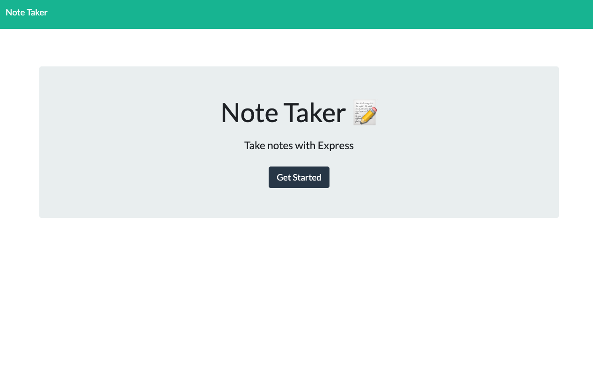
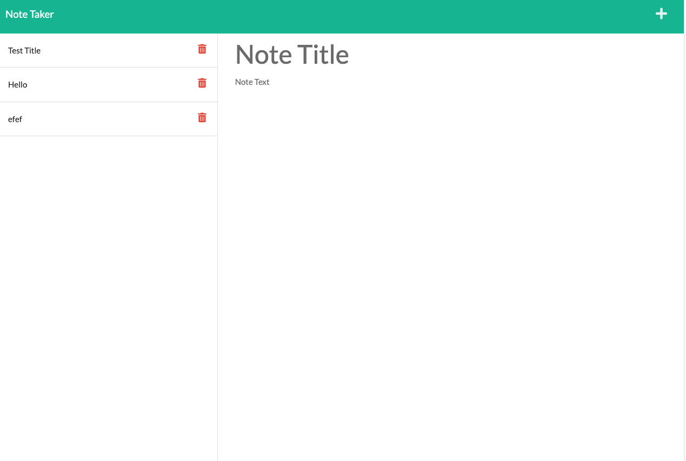

# note-taker-clean

## Description:

Our assignment was to create a note taker app. We had to create get functions to retrieve different html files, as well as all the saved notes. There was also a post action so that new notes could be added.

## Screenshots:

## Links:

Deployed application: https://juanpedros-note-taker.herokuapp.com/

Github repo: https://github.com/phillipanthony11/note-taker-clean
